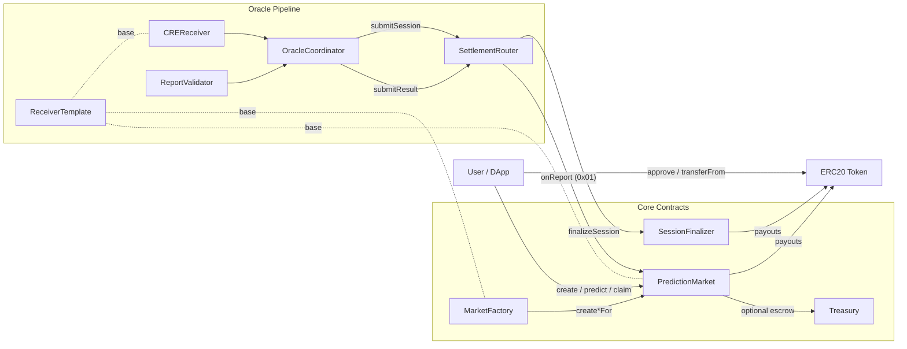
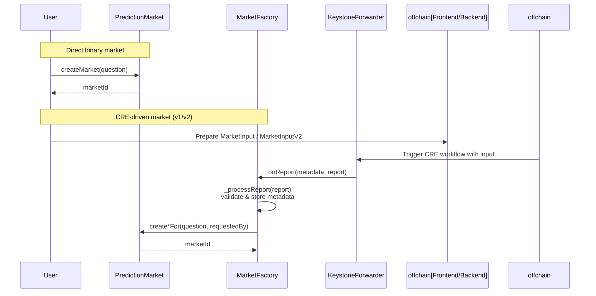
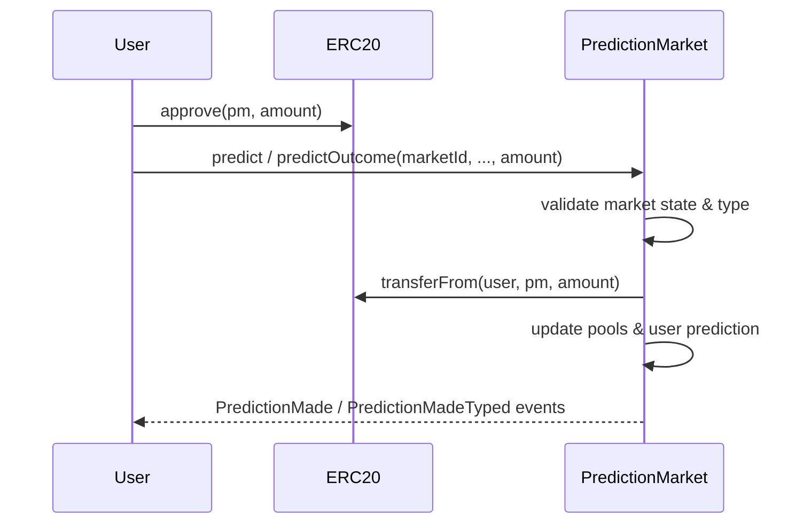
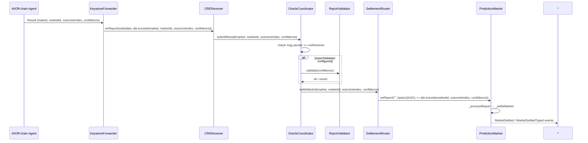
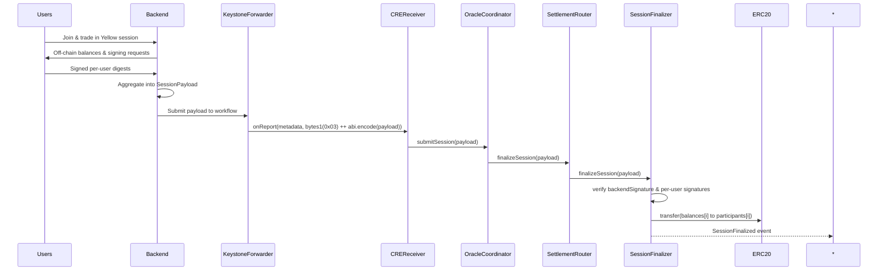
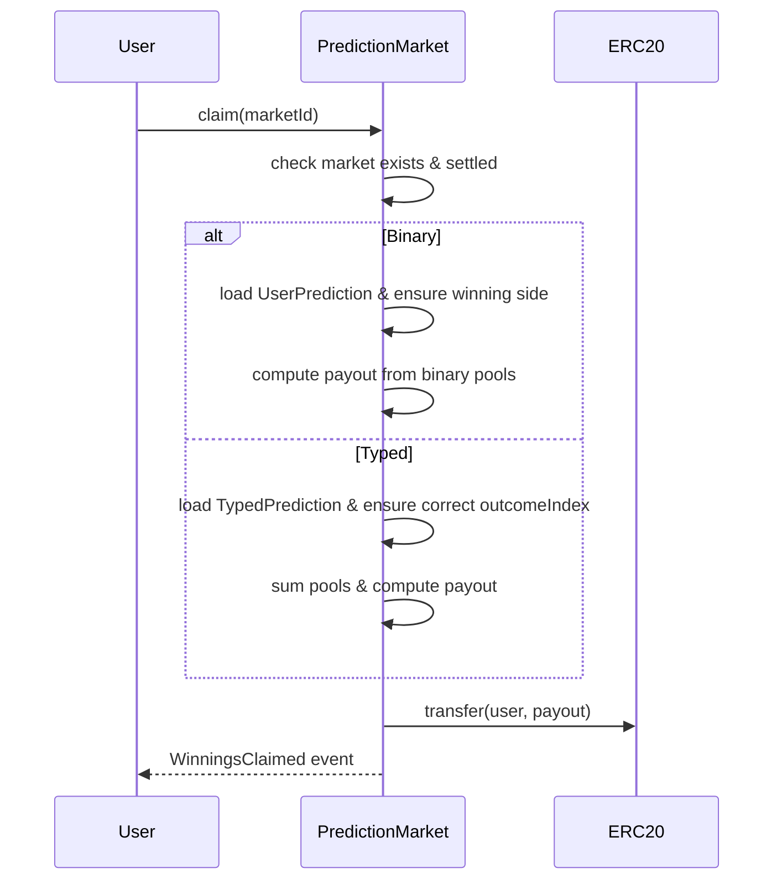

## ShadowPool Architecture

### Introduction & Project Goals

ShadowPool is an on-chain prediction market system built for the Chainlink CRE (Chainlink Reliability Engine / Keystone) bootcamp. It lets users stake ERC-20 tokens on the outcomes of binary, categorical, and timeline markets. Market outcomes are resolved using AI agents whose outputs are delivered on-chain via Chainlink Keystone Forwarder workflows. The contracts are intentionally compact but showcase secure oracle integration, typed markets, an optional escrow module, and a separate off-chain “Yellow session” flow for more UX-friendly trading experiences.

At a high level:

- **PredictionMarket** holds the markets, user positions, and pools, and pays out winners.
- **MarketFactory** creates markets from CRE reports and tracks metadata.
- **OracleCoordinator + CREReceiver + SettlementRouter** together form the oracle pipeline that routes AI outcomes and session snapshots to the right on-chain consumer.
- **SessionFinalizer** implements the Yellow session finalization mechanism.
- **Treasury** is an additive module that can escrow tokens on behalf of markets instead of having markets hold tokens directly.

The design favors explicit data flows, separation of concerns between market logic and oracle plumbing, and composability through small, focused contracts.

### High-Level Architecture

At the component level, the system looks like this:

Key ideas:

- **ReceiverTemplate** is embedded in contracts that are CRE entrypoints (`PredictionMarket`, `MarketFactory`, `CREReceiver`). It centralizes validation of the Keystone Forwarder and optional workflow metadata.
- **Oracle pipeline** is factored out (`CREReceiver → OracleCoordinator → SettlementRouter`) so that core market logic is independent of how results arrive.
- **Typed markets** (binary/categorical/timeline) share pool and settlement logic inside `PredictionMarket`, with “typed” storage for non-binary markets.
- **Yellow sessions** are modeled as a separate flow in which an off-chain backend aggregates session state, signs it, and then the on-chain `SessionFinalizer` validates and pays out.

### Core Contracts & Responsibilities

#### PredictionMarket (`src/core/PredictionMarket.sol`)

**Role**: Central market contract that stores markets, user stakes, and handles prediction, settlement, and claiming. It also serves as a CRE receiver for a subset of workflows.

- **Inheritance / dependencies**
  - Inherits `ReceiverTemplate`, so it exposes `onReport(metadata, report)` and benefits from forwarder + workflow validation.
  - Uses `IERC20` as the staking / payout token (referenced by a fixed `TOKEN_ADDRESS` constant, e.g. `0x3600…` on Sepolia).
- **Data model**
  - `enum Prediction { Yes, No }` – binary outcomes.
  - `enum MarketType { Binary, Categorical, Timeline }`.
  - `struct Market` – creator, timestamps, settled flag, confidence, winning outcome, binary pools, question string.
  - `struct UserPrediction` – amount, direction, claimed flag (for binary markets).
  - `struct TypedPrediction` – amount, `outcomeIndex`, claimed flag (for categorical / timeline).
  - Mappings:
    - `markets[marketId]` – market state.
    - `predictions[marketId][user]` – binary positions.
    - `typedPredictions[marketId][user]` – categorical/timeline positions.
    - `marketTypeById[marketId]` – encoded `MarketType`.
    - `categoricalOutcomes[marketId]` – outcome labels for categorical markets.
    - `categoricalPools[marketId]` – pool per categorical outcome.
    - `timelineWindows[marketId]` – ordered time windows for timeline markets.
    - `timelinePools[marketId]` – pool per timeline window.
    - `typedOutcomeIndex[marketId]` – winning index for non-binary markets.
    - `marketFactory` – address allowed to create markets “for” users.
- **Market creation**
  - `createMarket(question)` – direct binary market creation by any caller.
  - `createMarketFor(question, requestedBy)` – only callable by `marketFactory`, pins `creator` to `requestedBy`.
  - `createCategoricalMarket` / `createCategoricalMarketFor` – initialize typed market with outcome labels and pool arrays.
  - `createTimelineMarket` / `createTimelineMarketFor` – initialize typed market and store sorted timeline windows.
  - `_initTypedMarket` – shared initialization for categorical / timeline, enforcing at least 2 outcomes / windows.
  - `_storeTimelineWindows` – ensures ascending strictly increasing windows.
- **Prediction**
  - `predict(marketId, prediction, amount)` – binary markets:
    - Validates market exists, not settled, is `MarketType.Binary`, non-zero amount, and that the user has not already predicted.
    - Updates yes/no pool, records `UserPrediction`, and pulls tokens via `transferFrom`.
  - `predictOutcome(marketId, outcomeIndex, amount)` – categorical/timeline:
    - Validates market exists, not settled, non-binary type, non-zero amount, and no prior prediction.
    - For categorical – ensures `outcomeIndex` is within bounds of `categoricalPools`.
    - For timeline – ensures `outcomeIndex` is within bounds of `timelinePools`.
    - Updates the appropriate pool and records a `TypedPrediction`, then transfers tokens.
- **Settlement & CRE integration**
  - `_settleMarket(report)` – internal settlement function:
    - Decodes `(marketId, outcomeIndex, confidence)` from `report`.
    - Marks market as settled, stores `confidence` and `settledAt`.
    - For binary – checks index \(\leq 1\), stores `Prediction(outcomeIndex)`, and emits `MarketSettled`.
    - For categorical/timeline – checks `outcomeIndex` bounds in the relevant pools, sets `typedOutcomeIndex`, and emits `MarketSettledTyped`.
  - `_processReport(report)` – `ReceiverTemplate` hook:
    - If `report[0] == 0x01`, treats `report[1:]` as a settlement payload and calls `_settleMarket`.
    - Otherwise, decodes `report` as a `string question` and calls `createMarket(question)` (Day 1 demo behavior).
  - This design makes `PredictionMarket` both a direct CRE receiver (for simple workflows) and a pure business logic contract (when invoked via `SettlementRouter`).
- **Claiming**
  - `claim(marketId)`:
    - Validates market exists and is settled.
    - For binary:
      - Ensures user has a non-zero `UserPrediction`, not yet claimed, and predicted the winning side.
      - Computes `totalPoolBinary` and `winningPoolBinary`, then pays out pro-rata: \(\text{payout} = \frac{\text{userAmount} \times \text{totalPool}}{\text{winningPool}}\).
    - For categorical/timeline:
      - Fetches user `TypedPrediction`, checks amount, `claimed`, and equality with `typedOutcomeIndex`.
      - Accumulates total pools across all outcomes/windows; uses the winning pool and same pro-rata formula.
    - Uses `TOKEN.transfer` for payouts and emits `WinningsClaimed`.
- **Rationale**
  - Keeping all market and pool state in a single contract simplifies reasoning and avoids cross-market approval or upgrade complexity.
  - Typed markets reuse the same payout math and claim logic, minimizing code duplication while still allowing distinct UX (labels or time windows off-chain).
  - Acting as a CRE receiver for some workflows demonstrates integration without forcing all flows through the full router stack.

#### MarketFactory (`src/core/MarketFactory.sol`)

**Role**: CRE receiver that creates markets in `PredictionMarket` from feed-style inputs, with optional ECDSA validation of `requestedBy` and rich metadata.

- **Dependencies**
  - Inherits `ReceiverTemplate` (forwarder + metadata validation).
  - Uses `ECDSA` and `MessageHashUtils` for signature verification.
  - Talks to `PredictionMarket` via `IPredictionMarket` interface.
- **Input types**
  - `struct MarketInput` – v1 binary-only:
    - `question`, `requestedBy`, `resolveTime`, `category`, `source`, `externalId`, `signature`.
  - `struct MarketInputV2` – v2 typed markets:
    - Extends v1 with `marketType` (binary/categorical/timeline), `outcomes`, `timelineWindows`, and `signature` over the richer payload.
  - `struct MarketMetadata`:
    - Stored per market ID: `requestedBy`, `resolveTime`, `category`, `source`, `externalId`, `marketType`, `outcomesCount`.
- **Configuration**
  - `PREDICTION_MARKET` – immutable pointer to the deployed `PredictionMarket`.
  - `minQuestionLength`, `maxQuestionLength` – bounds for question strings (updatable via `setQuestionBounds`).
  - `usedExternalIds` – prevents duplicate external IDs across markets.
- **Report handling**
  - `_processReport(report)`:
    - If `report[0] == 0x02`, decodes `MarketInputV2` from `report[1:]`.
      - Validates input via `_validateInputV2` (requester not zero, question length bounds, resolveTime in the future, unique `externalId`, valid market type and counts, and optionally signature).
      - Calls `_createTypedMarket` to create the right type of market in `PredictionMarket`.
      - Stores `MarketMetadata` with computed `outcomesCount`.
      - Emits both `MarketSpawned` (high-level) and `MarketSpawnedTyped` (typed details).
    - Otherwise, decodes `MarketInput`:
      - Validates via `_validateInput` (similar rules but binary-only).
      - Creates a binary market via `createMarketFor`.
      - Stores metadata and emits `MarketSpawned`.
- **Signature validation**
  - In v1:
    - Digest = `keccak256(abi.encodePacked(address(this), requestedBy, question, resolveTime, category, source, externalId)).toEthSignedMessageHash()`.
  - In v2:
    - Additionally hashes `outcomes` and `timelineWindows` into `outcomesHash` and `windowsHash`, and includes them plus `marketType` in the digest.
  - If `signature` is non-empty, the recovered signer must equal `requestedBy`, otherwise `InvalidSignature`.
- **Rationale**
  - Separating the factory from the market:
    - Keeps `PredictionMarket` agnostic to metadata and external ID semantics.
    - Allows experimentation with different CRE workflows and metadata schemas without touching core market logic.
  - The `requestedBy` signature pattern lets the backend / front-end requestor be cryptographically tied to the resulting market, while still going through a trusted oracle.

#### SettlementRouter (`src/core/SettlementRouter.sol`)

**Role**: Simple router that receives validated outcomes and session payloads from `OracleCoordinator`, then dispatches them to the appropriate consumer.

- **State**
  - `oracleCoordinator` – address allowed to call `settleMarket` / `finalizeSession`.
  - `sessionFinalizer` – address of the `SessionFinalizer` contract (optional; can be zero for setups without Yellow sessions).
- **Access control**
  - `onlyOracleCoordinator` / `onlySessionFinalizer` modifiers referencing `Errors.Unauthorized`.
  - `setOracleCoordinator` and `setSessionFinalizer` are externally callable, with events but no explicit owner checks in this version (relying on controlled deployment / environment).
- **Functions**
  - `settleMarket(market, marketId, outcomeIndex, confidence)`:
    - Only callable by `oracleCoordinator`.
    - Constructs a CRE-style settlement report: `bytes.concat(bytes1(0x01), abi.encode(marketId, outcomeIndex, confidence))`.
    - Calls `onReport("", report)` on `market`, which is expected to be a `PredictionMarket` (or compatible).
    - Emits `MarketSettled`.
  - `finalizeSession(payload)`:
    - Only callable by `oracleCoordinator`.
    - Requires `sessionFinalizer != address(0)`; otherwise `InvalidAddress`.
    - Calls `ISessionFinalizer(sessionFinalizer).finalizeSession(payload)` and emits a placeholder `MarketSettled` event.
- **Rationale**
  - Encapsulates the encoding of settlement reports and decouples market contracts from direct CRE receiver responsibilities.
  - Provides a single place to wire in various settlement consumers (e.g. additional markets or other protocols) by updating router logic in the future.

#### SessionFinalizer (`src/core/SessionFinalizer.sol`)

**Role**: Implements the Yellow session finalization flow by validating an off-chain snapshot signed by both a trusted backend and individual users, then paying out ERC-20 balances.

- **State**
  - `TOKEN` – ERC20 used for payouts; provided at construction.
  - `trustedBackend` – address whose signature over the session state is required.
  - `finalizedSessions[bytes32]` – guard against re-finalization; key is `keccak256(abi.encode(marketId, sessionId))`.
- **Configuration**
  - Constructor requires non-zero `tokenAddress` and `backendSigner`.
  - `setTrustedBackend` allows owner to rotate the backend signer (with `InvalidAddress` protection).
- **Payload**
  - `struct SessionPayload`:
    - `marketId`, `sessionId`, `participants[]`, `balances[]`, `signatures[]`, `backendSignature`.
  - `finalizeSession(payload)`:
    - Decodes the payload and validates:
      - Non-empty participants.
      - Equal lengths for `participants`, `balances`, and `signatures`.
    - Computes `sessionKey` from `(marketId, sessionId)` and checks `finalizedSessions[sessionKey]` is false.
    - Computes `stateHash = keccak256(abi.encode(marketId, sessionId, participants, balances)).toEthSignedMessageHash()` and verifies `backendSignature` against `trustedBackend`.
    - For each participant:
      - Computes `userHash = keccak256(abi.encode(marketId, sessionId, participant, balance)).toEthSignedMessageHash()`.
      - Requires the corresponding `signatures[i]` to be signed by `participants[i]`.
    - Marks the session as finalized and transfers `balances[i]` from `TOKEN` to each participant (contract must hold funds beforehand).
- **Rationale**
  - Moves complex multi-action trading behavior off-chain, while ensuring final balances are both:
    - **Aggregated and approved** by a trusted backend.
    - **Individually acknowledged** by each participant.
  - Keeps on-chain verification narrow (signatures and balance transfers), making it easier to reason about security.

#### Treasury (`src/core/Treasury.sol`)

**Role**: Optional ERC20 escrow module that sits between markets and user funds.

- **State**
  - `TOKEN` – ERC20 being escrowed.
  - `approvedMarkets[market]` – whitelist of markets allowed to call `collectBet` / `pay`.
  - `marketEscrow[market]` – tracked pooled balance per market.
- **Functions**
  - `setMarketApproved(market, approved)` – toggles approval.
  - `collectBet(market, from, amount)`:
    - Only callable by `market` itself; requires `approvedMarkets[market]` and non-zero amount.
    - Transfers tokens from `from` to the treasury and increments `marketEscrow[market]`.
  - `pay(market, to, amount)`:
    - Only callable by `market`; requires `approvedMarkets[market]` and that escrow has enough balance.
    - Decrements escrow and transfers tokens to `to`.
- **Rationale**
  - Demonstrates a more production-like separation where markets do not custody tokens directly.
  - Left as an additive module so the main example can remain simpler with direct custody in `PredictionMarket`.

### Oracle & CRE Integration

The oracle integration is expressed as a layered pipeline, decoupling the Chainlink Forwarder integration from core business logic.

#### ReceiverTemplate & IReceiver (`src/interfaces/ReceiverTemplate.sol`, `IReceiver.sol`)

**Role**: Shared base for Keystone receivers.

- Validates:
  - **Caller**: optional check that `msg.sender` equals the configured Chainlink Forwarder.
  - **Workflow identity**: optional checks for workflow ID, owner (author), and name, all configured via setters:
    - `setForwarderAddress`, `setExpectedAuthor`, `setExpectedWorkflowName`, `setExpectedWorkflowId`.
  - Uses `_decodeMetadata(metadata)` to extract `(workflowId, workflowName, workflowOwner)` from the forwarded bytes.
- After checks pass, calls `_processReport(report)`, which is implemented by each inheriting contract.
- Implements `IReceiver` via ERC165.

This pattern centralizes security and validation logic, so contracts like `PredictionMarket`, `MarketFactory`, and `CREReceiver` only implement business-specific `_processReport` behavior.

#### CREReceiver (`src/oracle/CREReceiver.sol`)

**Role**: Primary entrypoint for CRE settlement reports and Yellow session payloads.

- Inherits `ReceiverTemplate` and holds a reference to `OracleCoordinator`.
- `_processReport(report)`:
  - If `report[0] == 0x03`:
    - Treats `report[1:]` as a session payload and calls `oracleCoordinator.submitSession(...)`.
  - Else:
    - Decodes `(market, marketId, outcomeIndex, confidence)` and calls `oracleCoordinator.submitResult(...)`.
- The Forwarder is expected to call `onReport` with appropriate metadata, which `ReceiverTemplate` validates.

#### OracleCoordinator (`src/oracle/OracleCoordinator.sol`)

**Role**: Dispatch layer that connects `CREReceiver` to `SettlementRouter`, with optional confidence gating.

- **Configurable addresses**
  - `creReceiver` – only this address may call `submitResult` / `submitSession`.
  - `settlementRouter` – target router to execute settlement and sessions.
  - `reportValidator` – optional address for confidence validation.
- **Functions**
  - `setCreReceiver`, `setSettlementRouter`, `setReportValidator` – wiring functions, emitting events.
  - `submitResult(market, marketId, outcomeIndex, confidence)`:
    - Restricted to `creReceiver`.
    - If `reportValidator != address(0)`, performs a low-level call to `validate(uint16)` and requires success; otherwise reverts with `InvalidConfidence`.
    - Calls `ISettlementRouter(settlementRouter).settleMarket(...)`.
  - `submitSession(payload)`:
    - Restricted to `creReceiver`.
    - Forwards the payload to the router via `finalizeSession`.

#### ReportValidator (`src/oracle/ReportValidator.sol`)

**Role**: Optional contract to enforce a minimum confidence score on oracle results.

- State:
  - `minConfidence` – threshold configured at deployment or via `setMinConfidence`.
- `validate(confidence)`:
  - Reverts with `Errors.InvalidConfidence` if `confidence < minConfidence`.

This module is intentionally small and stateless aside from the threshold, making it easy to swap or extend (e.g., multiple thresholds per market type).

### Data Models & Storage Layout

The system uses on-chain mappings and structs exclusively—no off-chain database or ORM.

- **Markets**
  - `Market` struct in `PredictionMarket` is the canonical market record.
  - `marketTypeById` records which variant is used; `categoricalOutcomes` and `timelineWindows` hold extra schema.
- **User positions**
  - Binary: `predictions[marketId][user]` → `UserPrediction`.
  - Typed: `typedPredictions[marketId][user]` → `TypedPrediction`.
  - Both track `claimed` so that users cannot double-claim payouts.
- **Metadata**
  - `MarketFactory.marketMetadata[marketId]` stores off-chain useful context (resolve time, category, source, externalId, etc.).
  - `usedExternalIds` ensures uniqueness across markets for external referencing.
- **Sessions**
  - `SessionFinalizer.finalizedSessions[sessionKey]` ensures each `(marketId, sessionId)` is finalized at most once.
- **Treasury**
  - `Treasury.marketEscrow[market]` holds aggregated balances for approved markets.

### Execution Flows

#### 1. Market Creation (Direct vs CRE)

- **Direct**: simplifies local testing and demos.
- **CRE-driven**:
  - Puts market creation behind a trusted oracle.
  - Attaches rich metadata and optional user signatures for `requestedBy`.

#### 2. User Prediction Flow

Key constraints:

- One prediction per user per market (enforced by checking stored amount == 0).
- Market must not be settled at the time of prediction.
- Amount must be non-zero.

#### 3. Oracle Settlement Flow

This flow:

- Verifies the settlement call path through `CREReceiver`, `OracleCoordinator`, and optionally `ReportValidator`.
- Uses an explicit prefix (`0x01`) to distinguish settlement reports in `PredictionMarket`.

#### 4. Yellow Session Finalization Flow

Design notes:

- Off-chain backend acts as aggregator and risk manager, but cannot change balances without user signatures.
- On-chain finalization is one-shot per `(marketId, sessionId)` thanks to `finalizedSessions`.

#### 5. Claim Flow (Classic Markets)

### Design Rationale & Tradeoffs

#### Separation of Concerns

- **Market logic vs oracle plumbing**:
  - `PredictionMarket` is responsible for market state and payout logic only.
  - Oracle-related concerns (forwarder validation, routing, confidence checks) are encapsulated in `ReceiverTemplate`, `CREReceiver`, `OracleCoordinator`, `ReportValidator`, and `SettlementRouter`.
  - This separation makes it easier to swap oracle providers or add new workflows while keeping market behavior stable.

#### Typed Markets in a Single Contract

- All market variants (binary, categorical, timeline) share one contract:
  - Pros:
    - Code reuse for claims and token handling.
    - Simplified indexing and event consumption for front-ends.
    - Easier to enforce cross-type invariants.
  - Cons:
    - Some additional branching logic (`if (marketType == ...)`) inside hot paths.
    - Storage layout is slightly more complex due to multiple typed mappings.

#### Oracle Safety and Flexibility

- Using `ReceiverTemplate` for:
  - **Caller restriction** to the Keystone Forwarder.
  - Optional validation of workflow ID/owner/name (defense in depth).
- `OracleCoordinator` introduces:
  - A single choke point for settlement rights.
  - A pluggable `reportValidator` contract for domain-specific confidence rules.
- Tradeoff:
  - More deployment/configuration steps (wiring addresses correctly) but clearer trust boundaries and testability (as seen in `OracleFlow.t.sol` and `YellowSessionFlow.t.sol`).

#### Yellow Sessions vs On-Chain Predictions

- Classic on-chain predictions (via `PredictionMarket`) are:
  - Fully transparent, but can be gas-heavy and latency-bound by block times and oracle update cadence.
- Yellow sessions:
  - Offer a smoother UX (multiple trades off-chain, single on-chain settlement).
  - Rely on an additional trust assumption: the `trustedBackend` must honestly aggregate trades and not censor users.
  - Mitigate unilateral backend power via per-user signatures, ensuring each participant consents to their final balance.

#### Optional Treasury Module

- Including `Treasury` as an additive module:
  - Demonstrates how custody and payout logic can be factored out without changing the oracle pipeline.
  - Allows future versions to:
    - Hold collateral per market in an isolated contract.
    - Introduce fee mechanisms or more complex risk management without bloating `PredictionMarket`.

### Configuration, Testing, and Conventions

- **Configuration**
  - `foundry.toml` configures `src`, `out`, and library remappings (notably `@openzeppelin/contracts` and `forge-std`).
  - No explicit deployment scripts are included; deployment is assumed to be handled via Foundry scripts or manual RPC calls.
- **Testing patterns**
  - `MarketTypes.t.sol`:
    - Validates categorical and timeline market creation via CRE-driven inputs (`MarketInputV2`).
    - Demonstrates use of `vm.etch` to deploy an `ERC20Mock` at the canonical token address used by `PredictionMarket`.
  - `OracleFlow.t.sol`:
    - Wires `SettlementRouter`, `OracleCoordinator`, `CREReceiver`, and `PredictionMarket` together.
    - Confirms that a CRE-style report settles a market end-to-end.
  - `YellowSessionFlow.t.sol`:
    - Exercises the full Yellow session path using explicit ECDSA signing with `vm.sign`.
    - Shows the expected encoding for `SessionPayload` and how balances are distributed.
- **Coding conventions**
  - Custom `Errors` library for common revert reasons (Unauthorized, InvalidAddress, InvalidAmount, InvalidConfidence).
  - Heavy use of `immutable` where appropriate (`PREDICTION_MARKET`, `TOKEN`).
  - Consistent event emission for key state transitions: market creation, predictions, settlements, payouts, configuration changes.

### Extending ShadowPool

This architecture is intentionally modular to support future expansion:

- **Per-contract deep dives**:
  - Additional docs can be added to `.docs/` focusing on `PredictionMarket`, Yellow session security, or deployment topologies.
- **Deployment and network configuration**:
  - A future `.docs/deployment.md` can outline recommended sequences for wiring forwarder, receiver, coordinator, router, factory, and markets across networks.
- **Security and threat model**:
  - A dedicated document could analyze:
    - Trust in the Chainlink Keystone Forwarder and AI pipelines.
    - Back-end trust assumptions for Yellow sessions.
    - Invariants in market pools and claim logic (no loss of funds beyond what users stake).

Overall, ShadowPool is structured as a clean reference implementation of an oracle-integrated prediction market, highlighting how to separate oracle concerns from market logic, how to support multiple market types, and how to bolt on an off-chain session mechanism without compromising on-chain verifiability of final outcomes.

